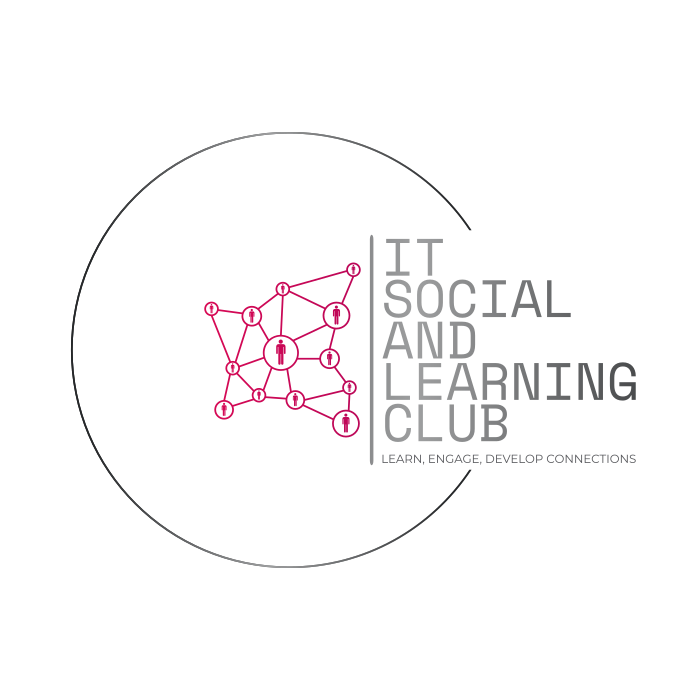

# IT Social and Learning Club

Learn, Engagte, Develop Connections

## About Us

The IT Social and Learning Club is a student lead group for the IT student community while attending Fanshawe College. We aim to be a place where students can come together for help with school, learn new things, attend social events, and a place to network with students past and present.

## Connect with Us

Want to learn more or join? Connect with us below:

* [Website](https://itslc2023.github.io/)
* [Discord](https://discord.gg/vCTzpmjD2B)

## Disclaimer

The IT Social Learning club is not affiliated with Fanshawe College. It is a student run organization create by and for students attending Fanshawe College.

The github site is intended to be used as a static backend of the site. Pushes are controlled and monitored. Malicous actors will be reported and restricted from making contributions

## License
Website content is under [CC BY 4.0 Deed Attribution 4.0 International](https://creativecommons.org/licenses/by/4.0/) Creative Commons license.  
Website code is under [MIT License](https://opensource.org/license/mit).